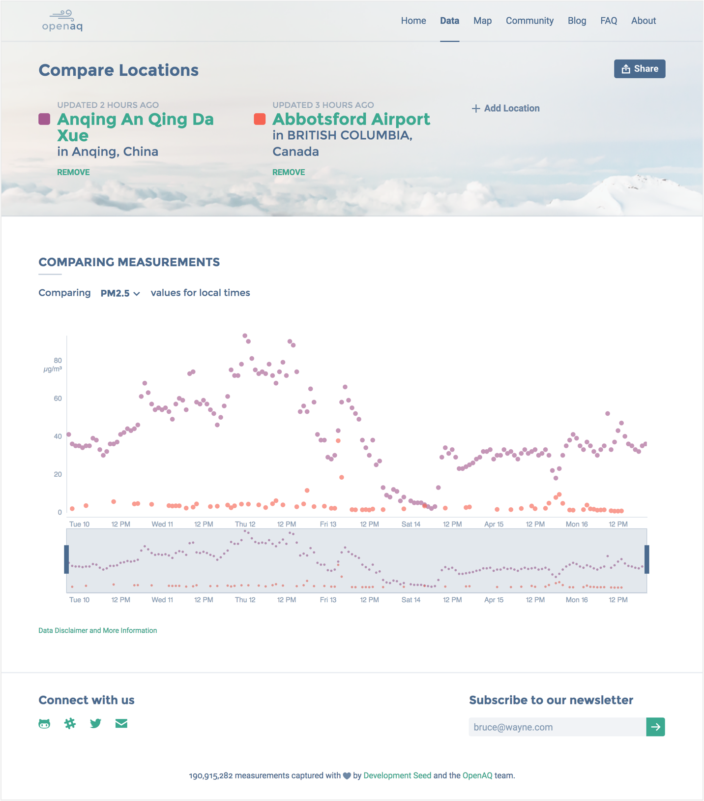

<section class='light'>

### GOALS

## Educate Communities and Encourage Change From Governments

OpenAQ is dedicated to collecting and archiving air quality measurements across the globe in order to fight air inequality and promote open source data and tools.

OpenAQ’s original website lacked clear information about their data sources.

The online database of air quality measurements wasn’t built in a way that could scale for their rapid growth. It was difficult to find and filter locations.

OpenAQ also lacked the resources necessary to grow and sustain a community.

</section>

<section>

### RESEARCH

## Identifying Barriers to Downloading Data and Connecting with Community

#### User Interviews
I interviewed current and potential users to collect qualitative data about their backgrounds, their interactions with data, and their professional challenges. OpenAQ identified their target users as journalists, scientists, researchers, and developers. I also gathered feedback on the current site.
 

#### Key Findings

* Data must be trustworthy
* Visualizations provide value for non-technical users
* Format and download size of data is important
* Current site navigation is confusing
* OpenAQ should rethink communications methods to reach more users

> "I would like to minimize my work with raw data in order to maximize my time with analysis."

#### Features Analysis
Based on user interviews, I determined which features made the most sense to include for their goals. For each feature, I looked at websites with similar content as the client's and provided examples of feature types, as well as recommendations of which options would work best for their needs.

The images below provides examples of this analysis.

</section>

<section class='light'>

### TESTING

## Using Quantitative Data to Improve Usability

Using a clickable prototype, I let previous users interact with the new site and asked them to complete specific designated tasks. During this process, I discovered which features had high error rates and made suggestions for design changes based on these.

For example, 80% of users had difficulty figuring out how to download data after filtering. This was problematic, considering the site’s primary function was the downloading of data. To address this issue, I added an option to download directly from the list view as well as the individual dataset page.

</section>

<section>

### FINAL PRODUCT

## Redesigning the User Interface and Growing the Community

#### Responding to Concerns
I responded to these concerns in the final product by displaying data sources in a more intuitive way, utilizing visual design and hierarchy, restructuring the navigation and providing more visualizations to users, including a new compare feature.  I also suggested highlighting their newsletter, as it was their most successful communication tool. 

> Before the redesign, OpenAQ's site dispalyed less than 1 million measurements. Currently, site gives access to over 200 million measurements.

> Over 20 community projects using OpenAQ's data are being tracked on the community page.

Visually, the client wanted something that felt professional and academic but also warm and inviting. I used soft, muted colors and photography, as well as clean UI elements to achieve this.

[Visit Site](www.openaq.org)

</section>

