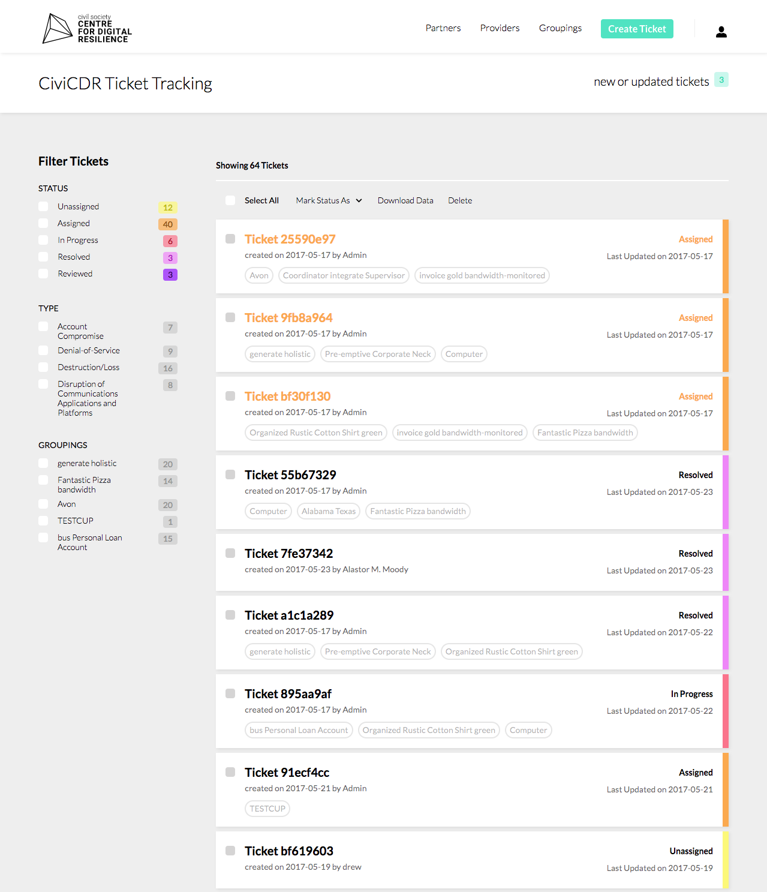

<section class='light'>

### BACKGROUND

## Lost in translation

When journalists fall victim to a cyber attack, it’s often difficult for them to connect with a security partner who can help solve their issue. The security providers usually don’t speak the same language. Nor do they have the time or desire to walk users through the complicated process of providing the appropriate metadata or removing corrupt hard drives. CiviCDR wanted a ticketing system that allowed journalists (or others) to submit help requests to security providers while CiviCDR acted as the middleman connecting the two parties. CiviCDR would also provide translation and technical assistance to the users.

#### Key Platform Needs

* Easily track a ticket from inception to completion
* The ability for both parties to communicate within the platform
* A way to ensure that security providers were reliable and fully resolved the client's issue(s)

</section>

<section>

### DESIGN SOLUTIONS

## Solving Diverse User Needs and Access Permissions Through Distinct Dashboards

CiviCDR's platform has three users: CiviCDR, Implementing Partners, and Security Providers. All three users required different dashboards and access rights based on their roles. Security Providers and Implementing Partners only needed information about tickets they were involved in, whereas CiviCDR needed to track the entire ecosystem.

The sitemap below shows the dashboards and functionalities of each user.

## Using Color for Quick and Easy Status Tracking

To allow CiviCDR to easily identify a ticket status from a list view, I created a system with five distinct statuses and corresponding colors. The colors also helped identify progress on individual ticket pages.

The screenshots below show the CiviCDR dashboard and ticket view.

 
## Grouping Security Threats

CiviCDR found that multiple tickets would sometimes stem from a single cyber attack. Rather than address each ticket individually, I created a system that grouped like tickets together and sent out mass notifications and assignments to users.

The wireframes below show a series of steps for finding, creating and deleting groupings.

## Feedback System for Better Matching

I also implemented a feedback system for users in which they could rate and describe their experiences with the security providers. CiviCDR could use this information to continually improve matches between the two.

## Designing a Secure Platform

Additionally, due to the sensitive nature of the platform content, security measures had to be considered throughout the design. These considerations included the erasure of data at ticket closing and providing encrypted contact information to parties.

</section>

