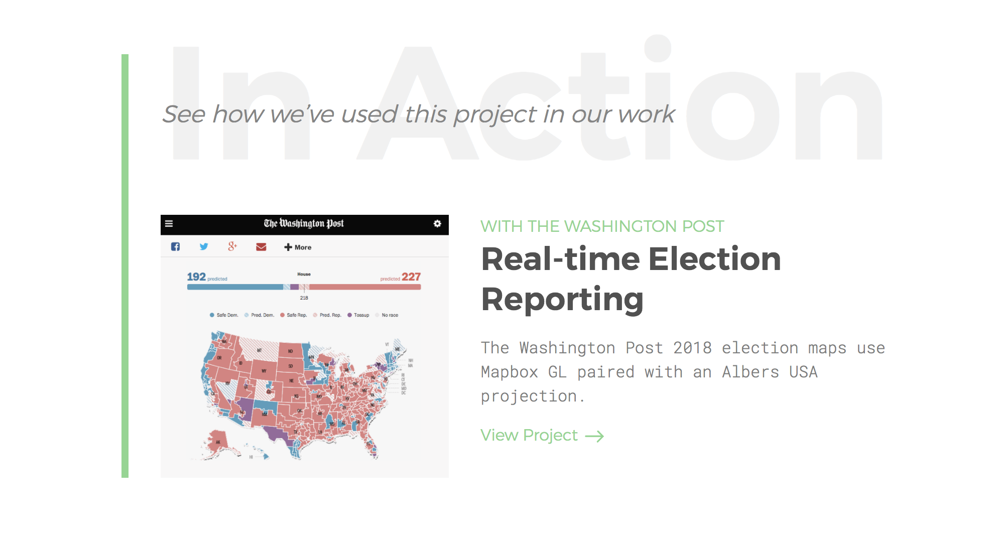

<section class='light'>

### BACKGROUND

## Showcasing Experimental Work and Personality

I noticed that some of the most exciting projects at Development Seed were created outside of client work, during dedicated “labs” time. I wanted to make sure these undertakings were highlighted in a way that set them apart from our usual projects and gave insight into some of the company's personality. Showcasing these efforts could attract new team members and inspire potential future collaborators.

I designed and developed a small microsite that could showcase this portfolio of work for Development Seed and be linked to from the main site.

</section>

<section>

### VISUAL DESIGN

## Creating a Visual Language for Non-Visual Works

I chose the name Greenhouse due to the experimental nature of the labs work being done, but also in homage to the name “Development Seed.”

The lack of visuals for some labs projects presented a challenge when trying to create an engaging portfolio for this work. To overcome this, I chose to incorporate U.S. Patent Office Images throughout the site as a visual reference to the project at hand, but also as a way to represent the innovative and inventive nature of the work.

I also chose to incorporate typographic elements to serve as visuals throughout project pages.

</section>

<section class='light'>

### DESIGN SOLUTION

## Translating Experimental Research to Client Projects

In order to illustrate to partners how labs work could benefit them, I included teases that showed actual paid client work using the technology we had originally developed in the labs.

</section>

<section>

### DESIGN SOLUTION
## Encouraging Contributions to Open Source Work

Development Seed has strong roots in the open source community and is always looking to contribute more open source work. I wanted to highlight this in a callout that encouraged others to utilize our work and offer their own contributions.

[Visit Site](https://greenhouse.developmentseed.org/)

</section>

