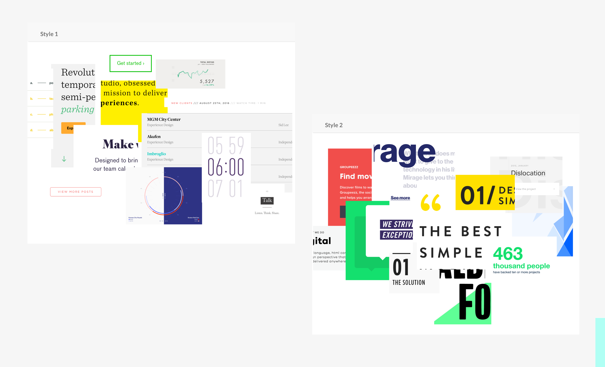
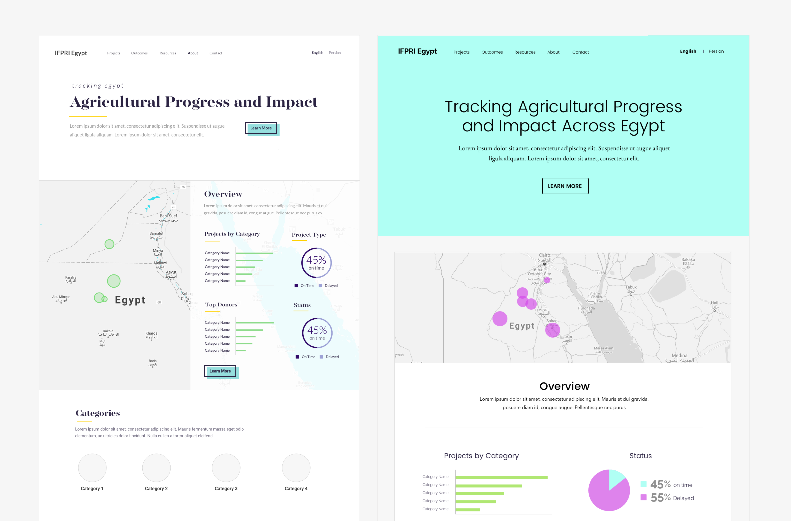
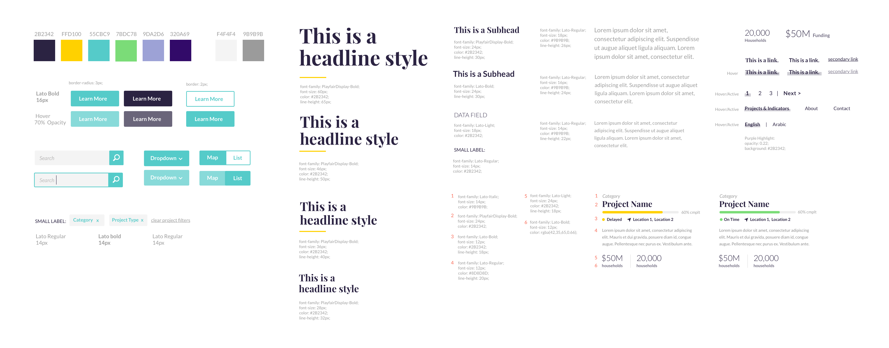
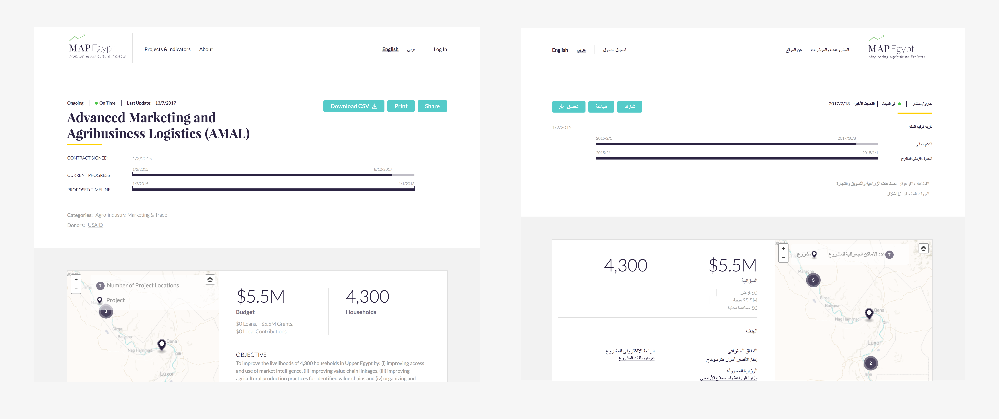
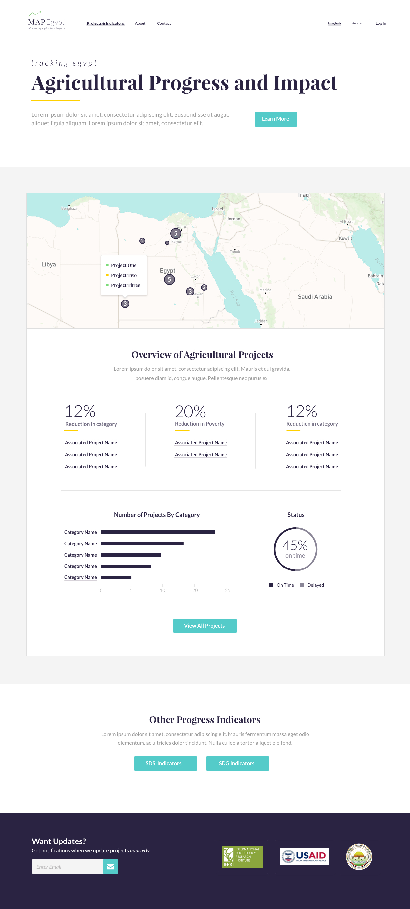
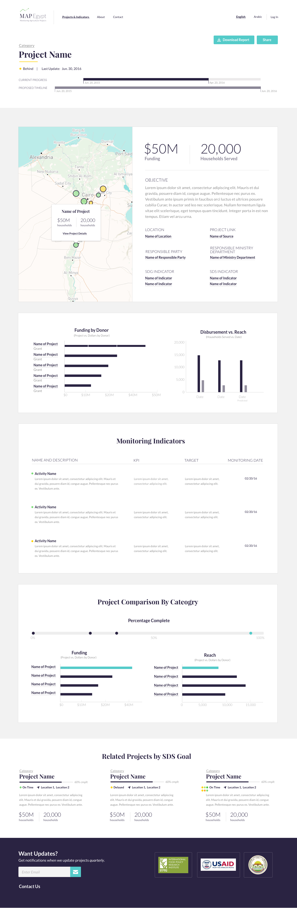

<section class='light'>

### BACKGROUND

The International Food Policy Research Institute (IFPRI) approached Development Seed to build a platform that would allow them to track the progress of agricultural projects all over Egypt. The platform needed to be displayed in two languages, English and Arabic, a right to left language. IFPRI also hoped to eventually expand this platform to create country specific versions. 

I was responsible for the visual design and HTML/CSS for this platform. 

</section>

<section>

### VISUAL RESEARCH

## Exploring Visual Design Inspiration

The client wanted a platform that felt friendly, impactful, inviting and professions. To start my visual design process, I created two mood boards to provide visual interpretations of these adjectives.

 

## Developing a Visual Direction

Based on the mood boards, I created two versions of the homepage that I felt represented the clients goals. I focused on bold typography and bright colors that felt impactful but also approachable and inviting.

 

</section>

<section class='light'>

### VISUAL DESIGN

## Creating a Design System Based on Components

Based on the homepage comp the client felt best represented their organization, I created a visual design system. This component sheet served as a visual tool to help maintain visual consistency during development and as the platform was scaled in different countries.

</section>

<section>

### FINAL PRODUCT

## Creating Stylesheets for Multiple Languages

During the development phase, I created an additional stylesheet that allowed the whole website to be read from right to left and still look visually appealing and organized. Arabic websites not only feature text that reads right to left but are also visually designed around this as seen in the image below. 

</section>

