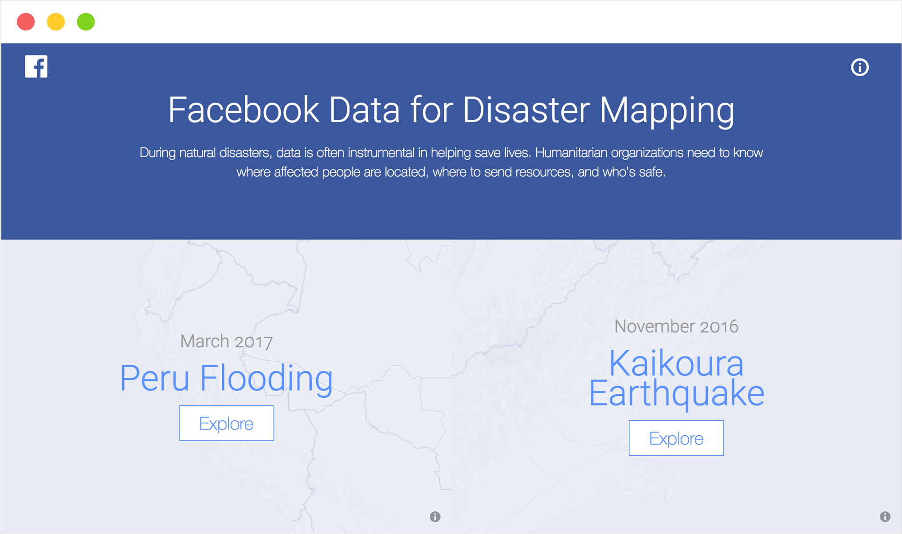
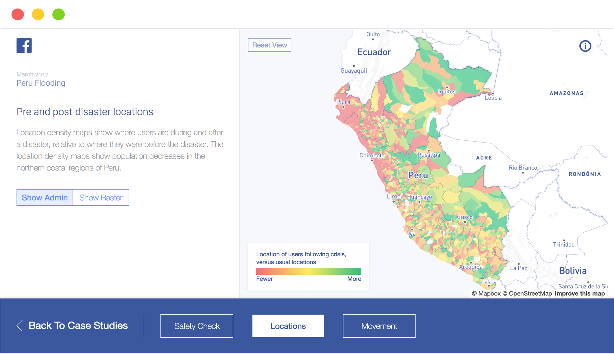
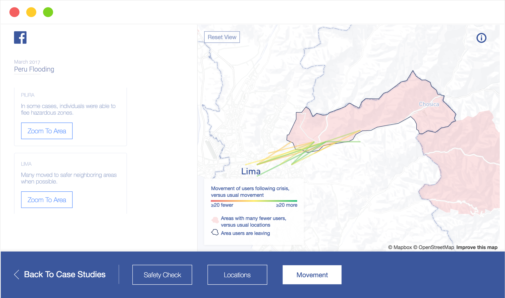
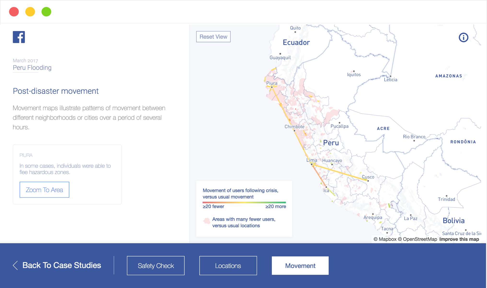

<section class='light'>

</section>

<section>

### DESIGN SOLUTIONS 

## Using a Narrative Format to Tell an Intuitive Data Story

I started by organizing the data in a way that made intuitive sense. First, data context was provided by showing where Facebook users had checked-in as “safe” during a disaster. Next, data was displayed that told whether this was normal location behavior of said Facebook users. Finally, I showed the movements of users during an actual disaster.

## Designing for Presentation Devices

Facebook wanted to present this information on iPads and large TV screens at a conference. In response, I adjusted the design to be full screen on any device, and kept the navigation buttons large and located at the bottom of the screen for easy usability.

## Finding Stories in the Data

On a national scale, the data was general and vague, and consequently unhelpful to the user; therefore, I allowed users to zoom in on smaller, highlighted areas within the countries. Facebook, along with our team, had assumed the data would show easy-to-read trends on a national level; but during the first prototype build with the actual data our team discovered this wasn't the case. To solve this, we added the ability to zoom to key areas for a more detailed (and useful) product.

The images below show the presentation of this data at both geographic levels.

</section>

